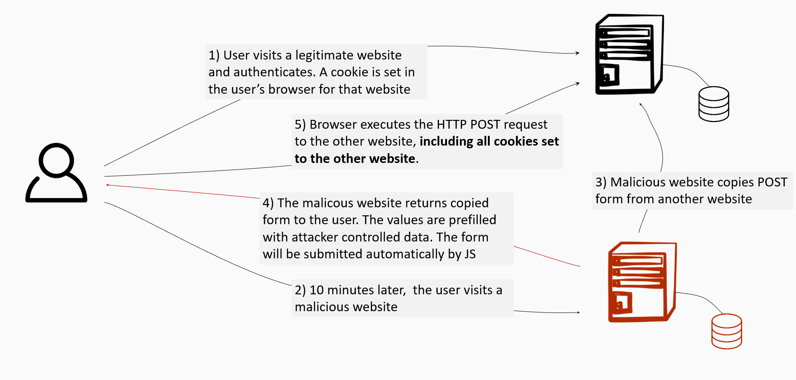

# Why and how does CSRF work?
A general property of web browsers is that they will automatically and invisibly include any cookies used by a given domain in any web request sent to that domain. This property is exploited by CSRF attacks in that any web request made by a browser will automatically include any cookies (including session cookies and others) created when a victim logs into a website. In the event that a user is tricked into inadvertently submitting a request through their browser these automatically included cookies will cause the forged request to appear real to the web server and it will perform any appropriately requested actions including returning data, manipulating session state, or making changes to the victim's account.

# What about the same-origin policy?
The [same-origin policy](001introduction\003basicbrowsersecurityconcepts\001sameoriginpolicy.md) protects against cross-origin reads, not against cross-origin writes. CSRF only cares about cross-origin writes, and therefore the same-origin policy can not help in preventing these attacks. 

According to [RFC2616](https://www.w3.org/Protocols/rfc2616/rfc2616-sec9.html#sec9.1.1), you should never use a GET to alter state server side. In other words, CSRF should only be applicable to POST, PUT, or DELETE operations. GET requests are only used for retrieval and are protected by the same-origin policy.  

# Source attribution
Some parts of this page are based on [Cross-site request forgery](https://en.wikipedia.org/wiki/Cross-site_request_forgery) by Wikipedia, which is licensed under [CC-BY-SA 3](https://en.wikipedia.org/wiki/Wikipedia:Text_of_Creative_Commons_Attribution-ShareAlike_3.0_Unported_License).